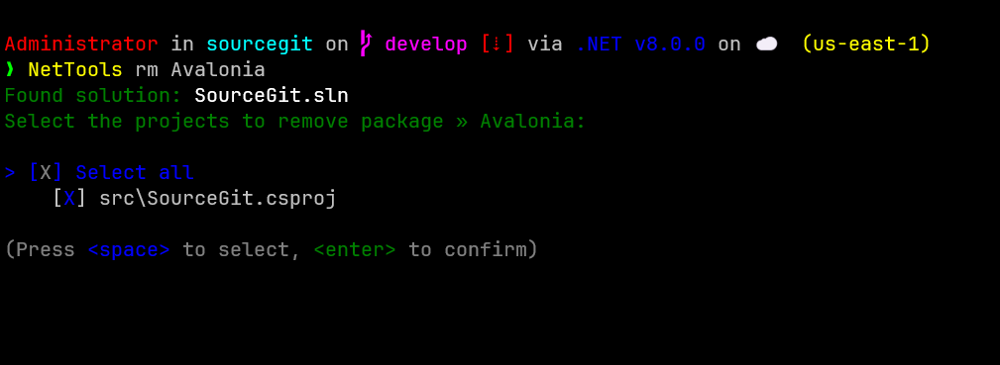

# NetTools

[](https://github.com/dougcunha/NetTools/actions/workflows/ci.yml)
[](https://github.com/dougcunha/NetTools/actions/workflows/build.yml)
[](LICENSE)

## Index

- [Features](#features)
- [Getting Started](#getting-started)
  - [Prerequisites](#prerequisites)
  - [Build and Run](#build-and-run)
  - [Usage](#usage)
- [Screenshots](#screenshots)
- [Related Projects](#related-projects)
- [Contributing](#contributing)
- [License](#license)
- [Community & Support](#community--support)
- [Third-Party Credits](#third-party-credits)

NetTools is a modern, open-source .NET CLI utility for discovering, standardizing, and managing NuGet package versions across multi-project solutions. It helps teams keep dependencies consistent and automates common maintenance tasks for .NET solutions.

## Features

- Discover all NuGet packages and their versions in your solution.
- Identify packages with multiple versions across projects.
- Standardize selected packages to the highest version found or a chosen version.
- Remove a NuGet package from selected projects interactively.
- Automatically update all affected `.csproj` files.
- Optionally run `dotnet clean`, `dotnet restore`, and `dotnet build` after operations (via flags).
- Interactive CLI with multi-select prompts and progress indicators.
- Status and progress feedback for all long-running operations.
- Supports verbose output for troubleshooting.
- Adheres to C# code style and documentation standards.

## Quality Assurance

NetTools maintains high code quality standards:

- **97.6% Code Coverage**: Comprehensive test suite with 155+ unit tests
- **Automated CI/CD**: GitHub Actions for continuous integration and delivery
- **Dependency Management**: Automated dependency updates via Dependabot
- **Code Quality**: Static analysis and linting in the CI pipeline
- **Automated Releases**: Semantic versioning and NuGet package publishing

## Getting Started

### Prerequisites

- [.NET 9 SDK](https://dotnet.microsoft.com/download/dotnet/9.0) or newer
- Windows, Linux, or macOS

### Build and Run

```sh
# Clone the repository
git clone https://github.com/dougcunha/NetTools.git
cd NetTools

# Build the project
dotnet build

# Run the tool (example)
dotnet run -- st
```

### Development

#### Running Tests

```sh
# Run all tests
dotnet test

# Run tests with coverage
dotnet test --collect:"XPlat Code Coverage"

# Run specific test project
dotnet test NetTools.Tests/NetTools.Tests.csproj
```

#### Code Coverage

The project maintains high code coverage. To generate a coverage report:

```sh
# Install coverage tools
dotnet tool install --global dotnet-reportgenerator-globaltool

# Run tests with coverage
dotnet test --collect:"XPlat Code Coverage"

# Generate HTML report
reportgenerator -reports:"**/coverage.cobertura.xml" -targetdir:"coverage" -reporttypes:Html
```

### Usage

#### Standardize NuGet package versions

- Discover all NuGet packages and their versions in your solution.
- Identify packages with multiple versions across projects.
- Standardize selected packages to the highest version found or a chosen version.
- Optionally run `dotnet clean`, `dotnet restore`, and `dotnet build` after operations (via flags).

```sh
NetTools st [<solution.sln>] [--verbose] [--clean] [--restore] [--build]
```

Options:

- `<solution.sln>`: (Optional) Path to the solution file. If omitted, the tool will search for a .sln in the current directory or prompt for selection.
- `--verbose` or `-v`: Show detailed output of dotnet commands.
- `--clean` or `-c`: Clean the solution after operation. Default: False
- `--restore` or `-r`: Restore the solution after operation. Default: False
- `--build` or `-b`: Build the solution after operation. Default: False

#### Update NuGet package versions

- Discover all NuGet packages and their versions in your solution.
- Fetch the latest NuGet package versions from NuGet.org.
- Identify packages with outdated versions across projects.
- Update all packages to the newest version.
- Optionally run `dotnet clean`, `dotnet restore`, and `dotnet build` after operations (via flags).

```sh
NetTools upd [<solution.sln>] [--include-prerelease] [--verbose] [--clean] [--restore] [--build]
```

Options:

- `<solution.sln>`: (Optional) Path to the solution file. If omitted, the tool will search for a .sln in the current directory or prompt for selection.
- `--include-prerelease` or `-p`: If true, includes prerelease versions when checking for updates. Default: False
- `--verbose` or `-v`: Show detailed output of dotnet commands.
- `--clean` or `-c`: Clean the solution after operation. Default: False
- `--restore` or `-r`: Restore the solution after operation. Default: False
- `--build` or `-b`: Build the solution after operation. Default: False

#### Remove a NuGet package from selected projects

- Remove a NuGet package from selected projects interactively.
- Automatically update all affected `.csproj` files.
- Optionally run `dotnet clean`, `dotnet restore`, and `dotnet build` after operations (via flags).

```sh
NetTools rm <packageId> [<solution.sln>] [--verbose] [--clean] [--restore] [--build]
```

Options:

- `<packageId>`: The NuGet package id to remove.
- `<solution.sln>`: (Optional) Path to the solution file. If omitted, the tool will search for a .sln in the current directory or prompt for selection.
- `--verbose` or `-v`: Show detailed output of dotnet commands.
- `--clean` or `-c`: Clean the solution after operation. Default: False
- `--restore` or `-r`: Restore the solution after operation. Default: False
- `--build` or `-b`: Build the solution after operation. Default: False

All commands are interactive and provide clear feedback. You can select which projects to affect in each operation.

## Screenshots

Below is an example of the interactive project selection screen:


### Remove package by id



## Related Projects

To make it easier to keep your NuGet packages up to date, we recommend using [dotnet-outdated](https://github.com/dotnet-outdated/dotnet-outdated). This tool scans your solution and helps you identify or apply updates to outdated NuGet dependencies automatically.

It works really well alongside **NetTools**, which is mainly focused on keeping package versions consistent across projects. While NetTools does offer basic features for discovering and updating versions, its main goal is to enforce standardization.

Using both tools together is a great way to keep your solution up to date and consistent, without overlapping features.

## Contributing

Contributions are welcome! Please see [CONTRIBUTING.md](CONTRIBUTING.md) for guidelines.

## License

This project is licensed under the MIT License. See [LICENSE](LICENSE) for details.

## Community & Support

- Issues and suggestions: [GitHub Issues](https://github.com/dougcunha/NetTools/issues)
- Pull requests are welcome!

## Third-Party Credits

This project uses the following open-source libraries:

- [Spectre.Console](https://github.com/spectreconsole/spectre.console) – For beautiful and interactive console UIs.
- [System.CommandLine](https://github.com/dotnet/command-line-api) – For building robust command-line interfaces in .NET.

Special thanks to the maintainers and contributors of these libraries for enabling a better developer experience!

---

Made with ❤️ for the .NET community.
