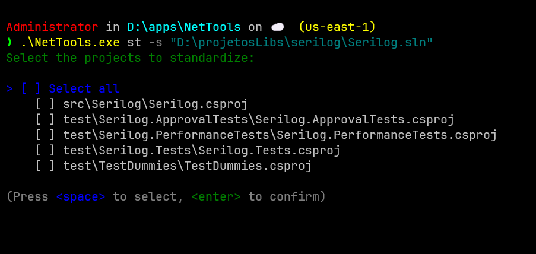

# NetTools

## Index

- [Features](#features)
- [Getting Started](#getting-started)
  - [Prerequisites](#prerequisites)
  - [Build and Run](#build-and-run)
  - [Usage](#usage)
- [Screenshots](#screenshots)
- [Contributing](#contributing)
- [License](#license)
- [Community & Support](#community--support)
- [Third-Party Credits](#third-party-credits)
- [Related Projects](#related-projects)

NetTools is a modern, open source .NET CLI utility for discovering, standardizing, and managing NuGet package versions across multi-project solutions. It helps teams keep dependencies consistent and automates common maintenance tasks for .NET solutions.

## Features

- Discover all NuGet packages and their versions in your solution.
- Identify packages with multiple versions across projects.
- Standardize selected packages to the highest version found or a chosen version.
- Remove a NuGet package from selected projects interactively.
- Automatically updates all affected `.csproj` files.
- Runs `dotnet clean`, `dotnet restore`, and `dotnet build` after operations (optional flags).
- Interactive CLI with multi-select prompts and progress indicators.
- Status and progress feedback for all long-running operations.
- Supports verbose output for troubleshooting.
- Adheres to C# code style and documentation standards.

## Getting Started

### Prerequisites

- [.NET 9 SDK](https://dotnet.microsoft.com/download/dotnet/9.0) or newer
- Windows, Linux, or macOS

### Build and Run

```sh
# Clone the repository
git clone https://github.com/dougcunha/NetTools.git
cd NetTools

# Build the project
dotnet build

# Run the tool (example)
dotnet run -- st --sln "path/to/your.sln"
```

### Usage

#### Standardize NuGet package versions

```sh
NetTools st <solution.sln> [--verbose] [--clean] [--restore] [--build]
```

- `--verbose` ou `-v`: Show detailed output of dotnet commands.
- `--clean` ou `-c`: Clean the solution after operation. Default: False
- `--restore` ou `-r`: Restore the solution after operation. Default: False
- `--build` ou `-b`: Build the solution after operation. Default: False

#### Remove a NuGet package from selected projects

```sh
NetTools rm <packageId> <solution.sln> [--verbose] [--clean] [--restore] [--build]
```

- `--verbose` ou `-v`: Show detailed output of dotnet commands.
- `--clean` ou `-c`: Clean the solution after operation. Default: False
- `--restore` ou `-r`: Restore the solution after operation. Default: False
- `--build` ou `-b`: Build the solution after operation. Default: False

All commands are interactive and provide clear feedback. You can select which projects to affect in each operation.

## Screenshots

Below is an example of the interactive project selection screen:



## Related Projects

For updating NuGet packages to their latest available versions, we recommend using [dotnet-outdated](https://github.com/dotnet-outdated/dotnet-outdated). This tool scans your solution and suggests or applies updates to outdated NuGet dependencies automatically. It is a perfect complement to NetTools, which focuses on standardizing and managing package versions across projects, but does not implement update/discovery of new package versions. By combining both tools, you can keep your solution both up-to-date and consistent, without duplicating functionality.

## Contributing

Contributions are welcome! Please see [CONTRIBUTING.md](CONTRIBUTING.md) for guidelines.

## License

This project is licensed under the MIT License. See [LICENSE](LICENSE) for details.

## Community & Support

- Issues and suggestions: [GitHub Issues](https://github.com/dougcunha/NetTools/issues)
- Pull requests are welcome!

## Third-Party Credits

This project uses the following open source libraries:

- [Spectre.Console](https://github.com/spectreconsole/spectre.console) - For beautiful and interactive console UIs.
- [System.CommandLine](https://github.com/dotnet/command-line-api) - For building robust command-line interfaces in .NET.

Special thanks to the maintainers and contributors of these libraries for enabling a better developer experience!

---

Made with ❤️ for the .NET community.
